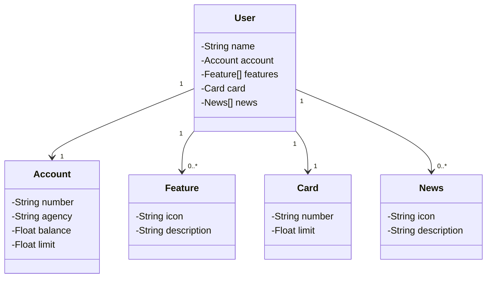

# API Rest na Nuvem com Spring Boot e Railway

Criação de um API Rest na nuvem com Spring Boot e Railway

## Diagrama de Classes

```mermaid
classDiagram
    class User {
        -String name
        -Account account
        -Feature[] features
        -Card card
        -News[] news
    }

    class Account {
        -String number
        -String agency
        -Float balance
        -Float limit
    }

    class Feature {
        -String icon
        -String description
    }

    class Card {
        -String number
        -Float limit
    }

    class News {
        -String icon
        -String description
    }

    User "1" --> "1" Account
    User "1" --> "0..*" Feature
    User "1" --> "1" Card
    User "1" --> "0..*" News

```